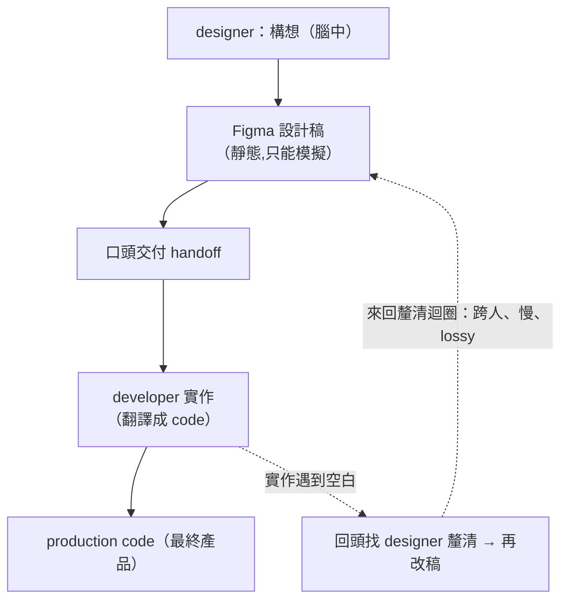
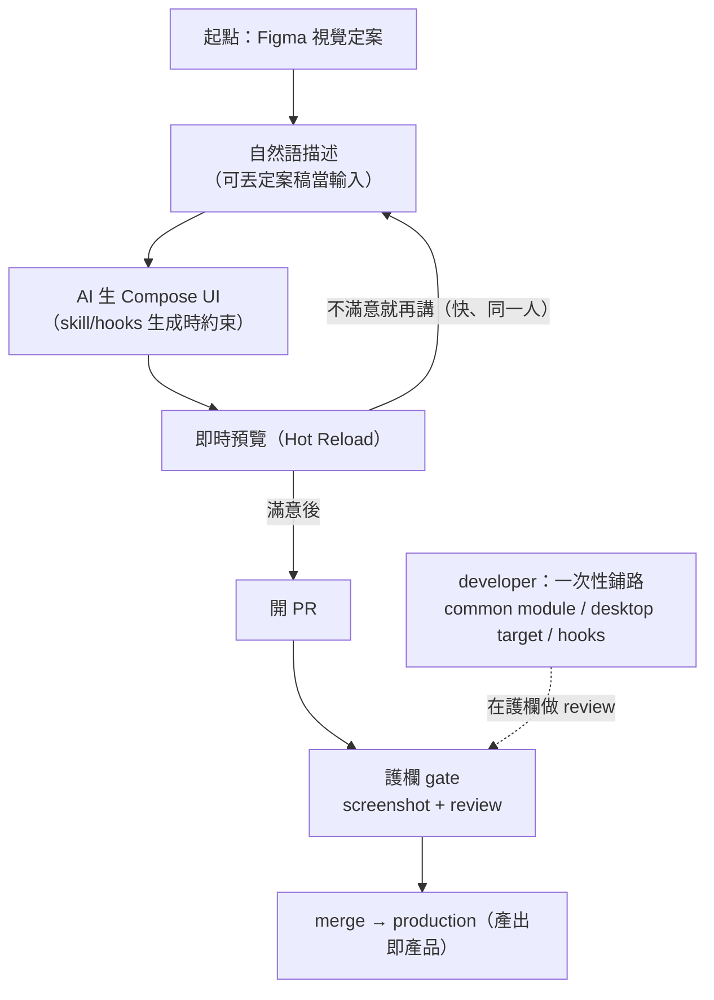
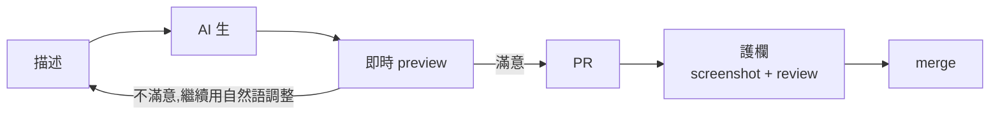
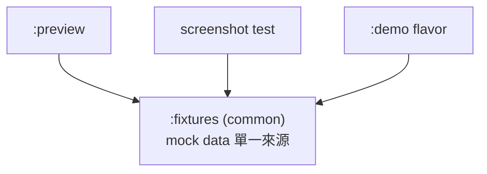

# RFC: Designer-to-Code Workflow for Android — Design 直接成為 Production Code

> 來源：[Confluence](https://viewsonic-vsi.atlassian.net/wiki/spaces/myViewboar/pages/554926106/RFC+Designer-to-Code+Workflow+for+Android+Design+Production+Code)
> Space: myViewboard ｜ Author: Stephen Yang ｜ Last modified: 6月 16, 2026

| Status | DRAFT / FOR DISCUSSION |
| --- | --- |
| Scope | 公司所有 native Android apps(Jetpack Compose) |
| Type | 通用 workflow / 工程規範(非單一專案方案) |
| Author | Stephen |
| Reviewers | TBD |

# Abstract

今天一個 UI 從 designer 腦中到產品,要走「構想 → Figma 稿 → 口頭交付 → developer 實作」這條鏈,每一手都耗時且 lossy。本 RFC 提出一套通用的 designer-to-code workflow:讓 designer 用自然語 + AI 直接生成 Compose UI code(落在 platform-neutral common module),且該產出_即_ production —— 不再產一份需要被 developer 翻譯的中間設計稿。為避免 AI 生出的 code 走樣或破壞既有 design system,生成端分兩道約束:生成前用 AI 規範檔(Claude Skill / rules)引導 AI 走既有 component catalog 與 design token,生成當下用 Claude Code hooks 擋下可機檢的違規(hardcode 色值、Android-only import 等)。架構上,這層 common UI 再配一個 dev-only desktop target 跑 Compose Hot Reload,讓 designer 不開 Android Studio 就能即時預覽;最後以 screenshot test(視覺)+ engineer review(結構/行為)兩道護欄事後把關。此流程目標適用公司所有 native Android app,但前提是該 app 先具備(或先建立)component catalog + design token、並願意做 UI 層解耦;建議先以單一 feature 做 pilot,用數據驗證後再擴散。整條 loop 的引擎是「AI 能否穩定產出守既有 design system 的 Compose」(E9),連同 designer 職能轉變意願(P4 + D1),列為 pilot 必須先答的 deal-breaker。

# Why / Background

## 現況:從 designer 腦中的設計到產品的傳遞鏈

今天一個 UI 從構想到產品,要經過這條傳遞鏈:**designer 腦中的 design → 用 Figma 畫成設計稿 → 交付給 developer 並口頭描述、補充細節 → developer 實作成產品**。意圖要從一顆腦袋正確地搬到另一顆腦袋,中間每一次轉手都花時間、也都掉資訊。

這條鏈有三個結構性損耗:

* **靜態稿天生裝不下完整實作細節**:Figma 稿即使畫得精緻,也表達不了 state 變化、邊界 case、精確的間距與行為值等實作必需的資訊。developer 拿到後仍要反覆向 designer 釐清這些空白 — 來回釐清正是耗時與 lossy 的主因(問題不在畫得好不好,而在靜態媒介的表達上限)。
* **動態行為只能模擬、無法成為真實**:轉場、互動回饋這類「會動的東西」,Figma 至多做到「模擬」,而模擬 ≠ 真實的 runtime 行為,落差仍要靠口頭與想像補。
* **發散點在源頭**:developer 拿到的是「壓縮 + 口傳」後的版本,做出來的結果與 designer 腦中所想之間,天生就有落差。

理想結局是:Figma 留著做發想與視覺定案,但**定案之後不再靠口頭交付給 developer 重新實作一次** —— 而是讓 designer(搭配 AI)把定稿直接落成可運行的結果,**設計定稿直接成為 production code**。如此被消滅的**不是 Figma 這個發想工具,而是「定案 → 重新實作」這段最耗損的 handoff**,讓意圖以更高保真度直接落地。

本 RFC 提出一套**讓 design(定稿)直接成為 production code 的 designer-to-code workflow**,適用於公司所有 native Android app,而非單一專案的方案。

## 流程對照:現況 vs 提案

**現況**:design → Figma → production,迭代卡在 designer 與 developer 之間的「來回釐清」(跨人、慢、lossy);中間的 Figma 稿是用完即丟、且只能模擬的中介物。



**提案**:Figma 定案後 → 直接落成 production,迭代收進 designer + AI 的快速內迴圈;產出即 production,developer 退成一次性鋪路 + 末端 review。



**關鍵差異**:(1) 迭代迴圈從**跨人**變**同一人**(不必等實作、不必回頭問);(2) **「定案 → 重新實作」的 handoff 消失**,設計定稿直接落成可進 repo 的 code(呼應判準 a);(3) developer 從「流程主線上的一棒」退成**旁邊鋪路 + 護欄 review**;(4) 唯一跨人接觸(review)落在迴圈**之外、且單向**往 production。

## 為什麼產出必須「即 production」、且需要即時回饋

上面證明了傳遞鏈有損耗,但這只證成「需要更高保真的傳遞」,還沒證成本 RFC 的兩個較強主張。這裡把它們**從問題本身推出來**,而不是當作前提:

**(1) 為什麼設計產出必須「即 production」,而不是另做一份設計稿讓 developer 翻譯?** 只要 designer 的產出是一份「需要被 developer 再翻譯成 production」的中間設計稿(無論它多高保真),就一定保留「翻譯」這道損耗 — 這正是現況 Figma 稿的問題。要真正消滅傳遞損耗,設計產出必須**不需要被再翻譯一次**,也就是設計產出本身即 production code。

**(2) 為什麼「即時回饋」是必要條件,而非 nice-to-have?** 去掉 Figma 後,designer 判斷產出對不對的唯一方式,是看到它真的跑起來。若沒有即時回饋,在 code 上的迭代會退化成「盲改 → 等 build → 再看」,慢到不可用,自然語 + AI 的迭代 loop 不成立。因此「改動即時看到真實畫面」是這條流程能否運作的前提,而非附加好處。

**誠實的但書**:以上兩個主張的前提是「設計稿 → production 二次翻譯的損耗夠大」與「designer 的 code 迭代需要夠快」。若 pilot 實測發現「維持設計稿 + 高效交接」的損耗已經夠低,或迭代其實不需即時,那「設計產出即 production」與「即時回饋」這兩個強主張就應**對應降級**,方案規模也應隨之縮小。這兩點列為 pilot 要驗的核心假設。

# 職能分工:這套流程改變了誰、怎麼變

這不只是一套工具,而是 designer 與開發者**分工的重新定義**。核心是把「產出 UI」和「打造能安全產出 UI 的環境」拆給兩個職能:designer 直接產出最終 UI,開發者負責鋪路。

| 職能 | 現況角色 | 新角色 |
| --- | --- | --- |
| **Designer** | 用 Figma 畫設計稿 → 交付 → 口頭補細節 | 用 Figma 發想/定案,接著用自然語 + AI **把定稿直接落成最終產品 UI**,即時預覽、自己開 PR;**不再把定稿口頭交付給 developer 重做** |
| **開發者** | 收稿 → 實作畫面 | **架構 app**:把 UI 與資料嚴格分離、建立可組裝的元件與護欄、提供**改動即時回饋**的 iteration 環境,讓 designer 能安全地直接產 UI |

一句話:**designer 從「畫稿交付」變成「定稿後直接落地」;開發者從「實作畫面」變成「打造讓 designer 能直接產出的架構與工具」。**

# What

## 目標與非目標 (Goals & Non-Goals)

**Goals**

* designer 能**即時把 UI 構想看成可運行的真實畫面**,而非靜態稿。
* designer + AI 的產出**就是可進 repo 的產品 code**,而非另一份需要被翻譯的設計稿。
* 用兩道護欄(自動化視覺驗證 + 工程 review)確保產出品質。

**Non-Goals**

* **不**取代 Figma 的發想 / 視覺定案階段 —— 本流程**接在設計定案之後**,把定稿落成 Android production code,而非取代 designer 在 Figma 的思考;既有 Figma assets 還可直接當 AI 的輸入。
* **不**把任何 app 變成真正出貨的多平台產品。
* **不**改動既有的 business logic 架構(VM / Repository / 商業規則 / 既有 DI 維持不動;本流程只調整 **UI 表現層的擺放方式** — 把畫面從 logic 中分離出來,屬 UI 層重構,不是 business logic 的架構改動)。
* **不**自建複雜的雲端服務,也**不**維護一個與 production 平行、會逐漸走樣的「designer 專用 app」。

## 方案輪廓

做法的核心是一個觀念上的切分:**把「畫面長相」這一層,從「資料與商業邏輯」中乾淨地分開**,讓畫面成為「給定一組資料就能獨立呈現」的部分。

切開之後:

* designer + AI 只需在「畫面長相」這層工作,餵假資料就能**即時預覽真實畫面**,且這份產出可直接成為 production 的一部分。
* 「看得見的正確性」(視覺)由自動化視覺比對守;「看不見的正確性」(效能、結構)由工程 review 守。兩道護欄讓「designer+AI 直接產 code」是安全的。

**提醒**:本流程兩個強主張 —「設計產出即 production」與「改動即時回饋」— 的必要性已在 **Why** 段從問題推導(含降級但書),不在此重述。後面 How 的技術選型(desktop target / Hot Reload)是為了滿足「即時回饋」這個需求,而非為了工具本身。

技術選型與落地細節見 **How**。

## 本 RFC 的三個層次:元件 gallery / user flow / workflow

為避免「這份 RFC 到底聚焦什麼」的誤解,先把三件常被混為一談的事分層講清楚:**workflow 是主軸,另外兩者是支撐它、且有落地先後的基礎設施**。

| 層次 | 是什麼 | 在本 RFC 的定位 / 階段 |
| --- | --- | --- |
| **UI 元件庫 / 元件目錄(gallery)** | 把元件抽出來、在獨立 gallery 裡單獨展示與迭代(Storybook 式;見 Preview Pipeline 的 `:preview` / Showkase)。 | **第一步先解決(Phase 1)**。 |
| **畫面流程 / User flow**(使用者點了 A 元件怎麼走到 B 畫面) | 做成**可點擊的 user-flow gallery**,讓 designer 在 gallery 內就點著走一遍 A→B→C 的流程。做法:把「導航」抽成平台中立的 nav event(designer 不碰 `NavController`),AI 生出對應 event,gallery 攔截後做假導航預覽。 | **加值、價值更高的下一步(Phase 2)**;navigation 目前留在 wiring 層,是否納入 designer loop 列為 open question。 |
| **工作流程 / workflow**(designer 自然語 → AI 生 → 即時預覽 → PR → merge) | designer 從想法到 production 的迭代 loop(見 Workflow 段)。 | **本 RFC 的主軸**;上面兩層都是為了讓這條 loop 跑得快、跑得安全。 |

一句話:**workflow 是主軸,元件 gallery 是第一步,user flow 是加值的下一步。**

**關於「Figma 是 platform-neutral」**:Figma 的「跨平台」指的是**設計稿中立** —— 同一份稿可以餵給各平台,但它本身**不產出任何平台的 production code**,跨平台是靠「每個平台各自再實作一次」達成,而那次實作正是本流程要省掉的 handoff。本流程針對 **native Android app**:對只出 Android 的 app(如 ClassSwift),Figma「也支援 iOS / web」用不到,卻仍要吃那道 handoff。兩者解的是不同問題 —— Figma 解「設計稿跨平台」,本流程解「Android 上設計定稿 → production 不再翻譯」,因此**並存**:Figma 發想/定案 → 本流程落地(見 Alternatives G)。

# 替代方案與否決理由 (Alternatives Considered)

在選定本方案前,評估過以下替代路徑。判準是三個必要條件,缺一即否決:**(a) 產出即 production(不 drift)、(b) 改動即時回饋、(c) design-system-safe(AI 產出守既有元件與 design token)**。其中 **a、b 的必要性已於 Why 段「為什麼產出必須即 production」推導出來;c 來自「AI 產 code 需守既有規範」的驗證需求** — 三者不是為了淘汰他人而設的標準,而是從問題推出的條件。

**drift**(漂移):指兩份本該一致的東西(例如設計稿與實際產品、或副本與本尊)因為分開維護,隨時間各自被改、慢慢對不上、不再同步的狀態。本流程的許多設計,目的就是讓東西「只有一份」,從根本上消除 drift。

| 替代方案 | 內容 | 為何否決 / 採用 |
| --- | --- | --- |
| A. 換一個 design-to-code 工具(拖拉式,FlutterFlow 為其一例) | designer 在外部工具拖拉產 code 再匯出 | 多為 one-way export,改了 code 無法回到工具 → 與 repo diverge(違反 a);且非既有 design system、不守 design token(違反 c)。 |
| B. Figma Dev Mode / Relay 類 codegen | 從 Figma 設計稿直接生 code | Relay 已 sunset;Dev Mode 產 generic code,仍需大量人工接、不直接進 repo,Figma 的 lossy 問題沒解(違反 a、c)。 |
| C. Google AI Studio(text → Compose → preview) | 雲端用文字生 native Android app、內建瀏覽器 emulator 預覽。**即 Google I/O 2026(2026-05-19)發表的 native Android app 生成方案**:Antigravity Agent 生 Kotlin + Jetpack Compose(Material 3、single-activity 架構),可裝實機 / 發到 Play Console 內測,要續開需匯出 ZIP 或 GitHub。 | 是 greenfield prototyper,產 generic Material code、不認既有 design system、且為 client-side only(Firebase / server runtime 不支援)、不落既有 repo;適合當「探索」輔助,不能當 production 主流程(違反 a、c)。 |
| D. 維護一個平行的「designer 專用 app」 | 另開一個放 mock 資料的 app 給 designer 玩 | 與 production 平行 → drift、雙倍維護、久了腐爛(違反 a)。 |
| E. 不動架構,讓 designer 開 Android Studio + Live Edit | 直接用現有 IDE 即時編輯 | 綁 IDE、門檻高、無法脫離 AS;且沒有 UI/資料分離,AI 產 code 無安全邊界(違反 c,且即時回饋體驗差)。 |
| F. 純靠 AI 對 Figma 截圖生 code(無 component catalog / design token 約束) | designer 給截圖,AI 自由生 | 回到「猜」,結構錯誤難 review、不守 design system(違反 c)。 |
| **G. Figma 發想 → 本流程落地(混合)** | 保留 Figma 做早期視覺發散與定案,定案後再用本流程把畫面落成 production code | **← 本 RFC 採用的定位**。Figma 留在前段做視覺發散與定案,本流程接在定案後把畫面落成 Android production code:保住 Figma 的發散強項(對應 D2、D5)、designer 不必搬走既有 assets,只取代「定案 → 重新實作」那一手 handoff。代價:仍有一次「定案稿 → code」的交接,且發想稿與落地 code 可能 drift —— **交接界線怎麼劃、定案稿如何當 AI 輸入,列為 pilot 要驗的細節(對應 D2)。** |

A–F 因違反 a/b/c 被否決;**本方案(UI/資料分離 + 即時 preview + 護欄)是唯一同時滿足 a/b/c 的「落地」路徑**:產出直接是 repo 內的 production code(a)、desktop Hot Reload 給即時回饋(b)、component catalog + design token + review 守安全邊界(c)。而 G 不與本方案互斥 —— **本 RFC 即採此混合定位:Figma 做前段發想/定案,本方案做後段落地,只取代定案後的 handoff。**

# Workflow:designer 怎麼工作

**一句話心智模型**:可以把這個 **即時預覽(Live Preview)** 想成**一種 Figma 的 live editor** — 只是**編輯方式從拖拉改成「用自然語言描述」,而結果是「會動的真實畫面」而非靜態稿**。重點是它**不只是「看」,而是 designer 在這裡用自然語言「即時編輯」**:改了就看到,看到的是產品本身。

本節描述新流程下 designer 實際的操作 loop(回應「designer 的一天」)。前提決定:designer **不靠 Figma 落地、也不手寫 Kotlin**(Figma 仍可用於前段發想/定案),而是用**自然語言描述**讓 AI 生成 Compose code、即時預覽、並**自己開 PR** — 產出即 production。

## 核心 loop

| 步驟 | designer 做什麼 | 工具 / 產物 |
| --- | --- | --- |
| 描述意圖 | 用自然語言描述想要的畫面或變更(可附上 Figma 定案稿當參考)。例:「學生計分卡列表,每張卡含頭像、姓名、分數,右側加減分按鈕;空狀態顯示提示文字」 | AI chat(Cursor / Claude 等) |
| AI 生成 | **不手寫 code**;由 AI 生出只負責「畫面長相」的元件 | 受 component catalog 既有元件 + design tokens 約束 |
| 即時預覽 | 立即看到真實畫面,並切換載入中 / 空 / 錯誤 / 有資料 等情境 | 即時預覽(Live Preview)或 CI preview gallery(可瀏覽所有畫面與狀態的網頁型錄)+ 假資料樣本 |
| 自然語迭代 | 不滿意就繼續用自然語言調整(「卡片間距加大、分數字體加粗」),即時重看 | 重複 1–3 |
| 開 PR | 自己把這份 code 提交成 PR | git / PR |
| 護欄把關 | 等兩道 gate 通過、回應 review comment | screenshot test(視覺)+ engineer review(結構/行為) |
| merge | — | 進 main,成為 production(CI) |



用前面的比喻收束:整個 loop 就是「**在會動的 Figma live editor 裡,用講的來改畫面**」 — 描述、看到、再描述,滿意了就直接送進產品。

## designer 提供給 AI 的輸入方式(不只自然語言)

自然語言是主力,但不是唯一。designer 可單獨或**混搭**以下輸入,讓 AI 更準地生出想要的畫面:

| 輸入方式 | 怎麼用 | 適合的情境 |
| --- | --- | --- |
| **自然語言描述** | 用講的描述畫面結構、元件、狀態、行為 | 主力;表達意圖、調整、邏輯關係 |
| **參考圖 / 截圖** | 丟一張 Figma 定案稿、競品截圖、手繪草圖,請 AI 照著做(但仍受 component catalog / design token 約束) | 「長這樣」比講的快;**有現成 Figma 定案稿時的主要銜接點** |
| **指向既有畫面 / 元件** | 「照 ScoreScreen 的卡片樣式」「跟設定頁同一種 list」 | 沿用已存在的 pattern,確保一致性 |
| **design tokens / 元件名** | 直接點名要用的 design token 或 component catalog 元件(色票、間距級距、某個 Button 變體) | 要精準控制、不要 AI 自由發揮時 |
| **範例資料** | 給一份真實感的假資料(長名字、缺值、多筆),讓 AI 連邊界情境一起生 | 要一次看到極端值下的畫面(對應 D10) |
| **直接微調數值** | 在即時預覽裡看到後,用講的或直接改 design token 值微調(間距、字級、顏色) | 最後一哩的視覺打磨 |

無論用哪種輸入,**產出都受同一組護欄約束**(component catalog 元件 + design tokens + screenshot/review)。輸入方式只是「怎麼告訴 AI」,不改變「產出必須守規範、且即 production」這件事。其中「參考圖生 code」要特別小心:它與已被否決的替代方案 F(純截圖無約束生 code)的差別,在於這裡**仍強制走 component catalog / design token**,而非讓 AI 自由刻 — 此邊界的有效性也屬 E9(AI 可靠性)要在 pilot 驗的範圍。

## designer 需要的最小能力與環境

* **會用 AI 以自然語言(及上述其他輸入)描述需求並迭代** — 核心技能,取代「畫稿交付」
* **會啟動即時預覽(Live Preview)**(Hot Reload 視窗或開 gallery URL)— 環境佈建應腳本化,把成本降到最低
* **會開 PR、回應 review comment**
* **不需要**:手寫 Kotlin、懂 Gradle 內部、碰 business logic 層

## 這個流程怎麼回應設計視角的疑慮

| 疑慮 | 本流程的回應 |
| --- | --- |
| D1 寫 Kotlin 門檻 | designer 用自然語描述、AI 生,**不手寫 Kotlin** — 門檻從「寫 code」降為「描述 + 操作 loop」。 |
| D2 發想在哪 | **發想/定案仍在 Figma**(本流程接在定案後);既有 assets 可當 AI 輸入,不要求 designer 搬家。本流程只接管「定案 → production」那一段(見 Alternatives G、三個層次段)。 |
| D7 ownership | 自己開 PR = designer 開始為 build / regression 負一部分責;需配套權責與 escalation(列入 open questions)。 |
| D8 自主性 | PR 是 designer 的,但仍需 engineer review 過結構關 — 屬「designer 擁有 + engineer 把關」,非完全放行。 |

# How

**讀者路標**:以下是**開發者**的架構工作 — 如何把環境鋪好,讓上面的 Workflow 成立。**designer 不需要讀懂以下的 code 與 module 細節**;designer 只需看懂 Why / 職能分工 / Workflow 三段即可。

## 關鍵技術洞察 (為什麼這樣選)

以下幾點是整個落地方案成立的前提,也是常見誤解的澄清:

1. **共用 UI 在 Android 上 = Jetpack Compose 本身**。採用 Compose Multiplatform (CMP) 的 common UI,在 Android target 上底層就是用 Jetpack Compose render,不是 wrapper、不是另一套 engine。因此 runtime 效能損失可忽略;真正成本在 build time 與 APK size。
2. **採用 CMP 的理由不是跨平台出貨,而是跨平台 tooling**。我們需要一個非 Android 的 JVM target,才能掛上即時預覽工具 — 這是純 Jetpack Compose 給不了的。
3. **即時預覽(Hot Reload)只跑在 JVM(desktop)target,不支援 Android target**。它依賴 JVM + JetBrains Runtime (JBR) 的 enhanced class redefinition,而 Android app 跑在 ART。所以 UI 層必須能編進一個 desktop JVM target。
4. **「現況 preview 綁 Android Studio」是這條路上要先解的前提,不是現況痛點**。現況 designer 用 Figma、不碰 code 也不碰 IDE;要讓 designer 直接產 UI 並即時看畫面,就必須提供一條**不需打開完整 Android IDE** 的 preview 路徑 — 這正是下面 Preview Pipeline 要解的。
5. **preview 載具不是「第二個 app」,而是「共用 UI code 的第二個 entry point」**。重用 production 的 UI、只換資料來源(餵 mock state),避免 drift 與雙倍維護。
6. **AI 產 code 的瓶頸從 generation 變成 verification**。designer 看得出「視覺正確」,看不出「結構/行為正確」(recomposition、state hoisting、a11y)。因此 design token + component catalog + 視覺測試 + 工程 review 不是選項,而是讓 designer+AI 安全的前提。

## 釐清:Jetpack Compose vs CMP(採 CMP ≠ 做多平台產品)

reviewer 最可能問的第一個問題是「採 CMP 是不是要把 app 變成多平台產品?」**答案是否。** CMP 不是另一種 Compose,而是把 Jetpack Compose **延伸**到其他平台的版本;在 Android target 上,CMP 的 common UI 底層跑的就是 Jetpack Compose(非 wrapper)。本 RFC 採 CMP 的目的是**借一個非 Android 的 JVM target 來掛 Hot Reload 與 desktop preview(跨平台 tooling)**,而非跨平台出貨。

| 面向 | Jetpack Compose | Compose Multiplatform (CMP) |
| --- | --- | --- |
| 維護者 | Google | JetBrains(建在 Jetpack Compose 之上) |
| Target | 只有 Android | Android + desktop(JVM)+ iOS + web(Wasm) |
| Android 上的本質 | 原生 | **底層就是 Jetpack Compose**,非 wrapper |
| 資源系統 | `R.string` / `R.drawable` | `compose.resources`(`Res.*`),跨平台 |
| 平台特定 API | 直接呼叫 | 透過 `expect`/`actual` 隔離 |
| 新 API 到貨 | 最快(Google 主線) | 略晚一個版本(跟在 Jetpack Compose 後) |
| 生態(DI / Nav) | Hilt、Navigation 齊全 | 需多平台版(Koin / kotlin-inject、Nav multiplatform) |
| 成熟度 | 全面 stable | Android / iOS / desktop **stable**;web(Wasm)**beta** |
| 工具紅利 | Live Edit(綁 Android Studio) | **Hot Reload、desktop/web preview、可脫離 AS** |

結論:本 RFC 屬「只做 Android,但要 Hot Reload + 脫離 AS 的 preview」這個情境 — 因此採 CMP common UI、把 Android 當其中一個 target,但**不出貨** desktop/iOS。對我們而言 CMP 的價值在「跨平台 dev tooling」,不在「跨平台 ship」。

## 方案架構總覽

把 UI 表現層抽成 platform-neutral common module → 加一個 dev-only desktop (JVM) target 跑 Compose Hot Reload → designer 不開 Android Studio 即時 preview → screenshot test 與 PR review 當護欄。一筆拆分,三份回報:**即時 preview、screenshot gate、AI 產 code 的安全邊界**。

## Module 結構與依賴鐵律

```
:core:designsystem  (common)  ← AppTheme、design tokens、atoms (Button/Text…)
:core:ui            (common)  ← 共用 stateless 元件
:feature:<x>:ui     (common)  ← Screen、UiState、Event       ★ 可 preview / 可測
:feature:<x>:impl   (android) ← ViewModel、Repository、Hilt、Nav   ✗ 不 preview
:fixtures           (common)  ← 唯一一份 mock data (Samples)
:preview            (jvm app) ← Hot Reload 載具,餵 fixtures   ★ designer 跑這個
:app                (android) ← Activity / wiring,接起以上
```

**依賴方向鐵律**:`:feature:<x>:ui` 只能依賴 `:core:*`(皆 common);依賴方向只能 `:impl → :ui`,**絕不可反向**。一旦 `:ui` 洩漏依賴到 `:impl` 或任何 Android-only API,desktop target 會編譯失敗 — 這條線由 compiler 替我們守。

## platform-neutral 的定義

`commonMain` 內**不得出現任何 Android-only import**。常見洩漏與處理:

| 洩漏 (leakage) | 為何髒 | 處理方式 |
| --- | --- | --- |
| `stringResource(R.string.x)` | 綁 Android `R` | 字串在 VM resolve 後放進 `UiState`;或改用 `compose.resources` 的 `Res.string.*` |
| `painterResource(R.drawable.x)` | 綁 `R` | 傳 `ImageVector` / `Painter` 進來,或用 `Res.drawable.*` |
| `LocalContext.current` | Android-only | 移除;所需資料由參數帶入 |
| `colorResource` / Android theme attrs | 綁 Android theme system | 自建 `AppTheme`,design token 值寫在 Kotlin,以 `CompositionLocal` 提供 |
| `hiltViewModel()` / `NavController.navigate()` 寫在 screen | 框架耦合 | hoist 成 event lambda,VM / Nav 留在 wiring 層 |

真正平台特定的東西(各 app 的 device API、硬體相關 API、IPC 如 AIDL、screen capture 等)**留在** `androidMain`,必要時以 `expect`/`actual` 隔離,只有 UI 表現層進 common。

## UI / Logic 拆分

**原則:UI 是 state 的純函數。** 可 preview 的 composable = `(UiState) -> 畫面` + `(Event) -> Unit`,它不知道 state 從哪來、event 往哪去。

**Litmus test**:若能只靠 `new` 一個 `UiState` data class 就 render、不用 mock 任何 `Context`/`ViewModel`/`Repository`,即為乾淨、可 preview。

(以下以一個 Score 畫面為示意例。**注意**:此範例的 `@Immutable` + `List` stability 議題見工程視角 E2;字串策略此處先以已 resolve 的 `String` 示意,最終定調見 E4。)

`commonMain` **— 純 UI(可 preview / 可測):**

```kotlin
@Immutable
data class ScoreUiState(
    val students: ImmutableList<StudentUi> = persistentListOf(),  // 見 E2:用 ImmutableList,別用裸 List
    val isLoading: Boolean = false,
    val errorMessage: String? = null,        // 已 resolve 的字串,非 R.string(策略見 E4)
)

sealed interface ScoreEvent {
    data class AddPoint(val id: String) : ScoreEvent
    data object Refresh : ScoreEvent
    data object NavigateBack : ScoreEvent
}

@Composable
fun ScoreScreen(state: ScoreUiState, onEvent: (ScoreEvent) -> Unit) {
    AppTheme {
        // 只讀 state、只呼叫 onEvent(...)
        // ❌ 不得出現:LocalContext / R.* / viewModel() / NavController
    }
}
```

`androidMain` **/** `:app` **— 髒東西集中,不 preview:**

```kotlin
@Composable
fun ScoreRoute(
    navController: NavController,
    viewModel: ScoreViewModel = hiltViewModel(),
) {
    val state by viewModel.uiState.collectAsStateWithLifecycle()
    LaunchedEffect(Unit) {
        viewModel.effects.collect { /* navigation, snackbar… 一次性事件 */ }
    }
    ScoreScreen(
        state = state,
        onEvent = { e ->
            when (e) {
                ScoreEvent.NavigateBack -> navController.popBackStack()
                else -> viewModel.onEvent(e)
            }
        },
    )
}
```

一次性事件(導航、snackbar、toast)用 VM 的 `effects: Flow` 在 wiring 層消費,**不**放進 `UiState`(避免重播)。

## Preview Pipeline

**載具:**`:preview` **module(designer 端稱為「即時預覽 / Live Preview」,不需開 Android Studio)**。如前面比喻:這就是那個「**會動的 Figma live editor**」的實際載體 — 只是用自然語 + Hot Reload 驅動。

```kotlin
fun main() = singleWindowApplication(title = "UI Gallery (preview)") {
    DevelopmentEntryPoint {                       // 掛上 hot reload hook
        var state by remember { mutableStateOf(Samples.populated) }
        Column {
            StatePicker(onPick = { state = it })   // 切換 loading/empty/error/populated
            ScoreScreen(state = state, onEvent = {})
        }
    }
}
```

designer 改 `ScoreScreen` 的 layout/顏色/spacing → 存檔 → desktop 視窗即時更新,且 **state 不重置**(改 `remember` key 或 composition 結構時仍可能重置)。所有狀態靠 `:fixtures` 的假資料切換,**無需任何後端**。

**Compose Hot Reload 運作摘要**

1. file watcher 偵測存檔
2. Gradle recompiler 增量重編改動的 class(速度綁 build 速度 → 建議開 Configuration Cache)
3. 在 **JBR** 上做 enhanced class redefinition,把新 class 塞進執行中的 JVM
4. Compose runtime invalidate → 用新 function body 重跑 recomposition
5. state 活在 heap 上,redefine 只換「行為」不換「資料」→ 畫面更新但不回到首頁

**mock data 單一來源** — `:preview`、screenshot test、(未來的) demo flavor 都從同一個 `:fixtures` 取假資料,避免在多處各維護一套。



**元件型錄即 Storybook(isolated component development)**:上面的 `:preview` gallery 本質上就是 Compose 世界的 Storybook —— 一種 isolated component development:把每個元件從主 App 抽離,在獨立 catalog 裡單獨展示與互動,不必為了看 button 的某個 state 就把整個 App 跑起來、登入、導航過去。概念源自 web 前端的 Storybook.js(Flutter 也有對應實作);在我們的 stack 以 Showkase(自動列舉 `:core:ui` 元件)當實作,`:fixtures` 提供各 state(loading / empty / error / populated)、StatePicker 切換。

對本流程有三個直接好處:(1) designer 能直接跳到「某元件的某 state」迭代,省掉啟動 App + 導航的成本(強化判準 b 即時回饋);(2) 每個元件 × 每個 state 都被明確列出、可被 screenshot test 逐一掃,提高視覺 gate 覆蓋(連到 E3 的 preview 覆蓋率邊界);(3) 「元件要能被獨立 render」這個要求,等於強制元件保持 stateless、只吃 `UiState` —— 正好是「UI / Logic 拆分」那條 litmus test,兩者互相強化。

## 驗證護欄 (Validation Guardrails)

designer + AI 安全的前提,對應「designer 看不見的那一欄」。其中 **design tokens / component catalog 屬「事前約束(preventive)」— 收斂 AI 生成空間;screenshot / review 屬「事後驗證(detective)」— 抓已發生的問題**。What 段所說的「兩道護欄(視覺 + review)」即指後者兩道 gate,以下五項機制則是其完整拆解:

| 護欄 | 守住什麼 | 工具 |
| --- | --- | --- |
| Design tokens + (未來) Code Connect | 結構正確:從既有 convention 生 code,不從零猜 | `AppTheme` + design token pipeline |
| Curated component catalog | 收斂猜測空間:AI 組既有元件,不自由刻 | `:core:ui` + (規模化後) Showkase |
| AI 規範檔(Claude Skill / `CLAUDE.md` / rules) | **生成前**把規範餵給 AI,拉高首次合規率 | 單一規範 source;CI 對真實 component catalog 驗一致,避免 rules 檔自己 drift |
| Claude Code hooks(PreToolUse / PostToolUse) | **生成當下**確定性攔截違規寫檔、自動回饋 | `.claude/settings.json`(commit 進 repo、全 team 共用);harness 強制、非靠 AI 自律 |
| Screenshot test | 視覺正確:自動抓 regression | Paparazzi(JVM render,免 device)/ Roborazzi |
| Engineer review on PR | 結構/行為正確:recomposition、state、a11y | code review |
| 永遠走 PR,不直接進 main | 流程鐵律 | CI |

**規範怎麼餵給 AI、怎麼強制**:上述護欄依「強制硬度」分四層 —— L1 **軟引導**(Claude Skill / `CLAUDE.md` / rules,生成前餵規範)、L2 **確定性攔截**(Claude Code hooks,PreToolUse 違規即擋、PostToolUse 跑 lint / 依賴檢查回饋)、L3 **編譯期硬約束**(KMP 依賴鐵律)、L4 **事後偵測**(screenshot + review)。**Claude Skill / rules 是軟約束,AI 可以不遵守;真正的保證來自 L2–L4 的確定性機制。**兩個但書:(1) 規範檔本身會 drift —— 它列的「有哪些元件 / design token」必須從真實來源生成或由 CI 比對 component catalog,否則就變成另一份會腐爛的平行文件,違反本 RFC 的反 drift 主張;(2) 一條自訂 lint(Detekt)規則就能讓 E2(`@Immutable` 配裸 `List`)、hardcode 色值/間距等被自動接住,不必靠人 review。

效能正確性(over-recomposition、stability)無法靠 screenshot 守,需用 layout inspector / recomposition counts 追蹤 — 此點與是否採用 CMP 無關,是 Compose 本身的紀律。

## 風險與取捨 (Risks & Trade-offs)

| 風險 / 成本 | 說明 | 緩解 |
| --- | --- | --- |
| Migration 工量 | UI 層解耦 + module 切分是實打實的工 | 先以單一 feature 做 pilot 驗證 ROI,再決定擴散範圍;先把基礎設施(design token、module pattern)立穩再鋪 feature |
| 依賴生態 | Hilt 為 Android-only,common 層 DI 需評估 Koin / kotlin-inject;Nav/ViewModel 有 multiplatform 版 | 僅 UI 層需 neutral;logic 層維持 Android 不動,降低衝擊 |
| 新 API lag | CMP 跟在 Jetpack Compose 之後,最新 API 略晚到 | UI 表現層用到的多為穩定 API,影響有限 |
| Build time / APK size | KMP metadata compilation 拉長 build;CMP runtime 增加 size | 量測為準;K2 compiler 對大型 codebase build time 有顯著改善 |
| Web (Wasm) preview 成熟度 | desktop target 為 Stable,但 Wasm 仍為 Beta | 主力放 desktop preview + 靜態 Paparazzi gallery;web component catalog 當加分項 |
| desktop target 維護 | 多一個 target 要顧 | 僅作 dev-time 載具、不出貨,避開 desktop 出貨的長尾坑 |

**成熟度定位**:CMP 的 Android / iOS / desktop target 均為 **Stable、可 production**;web (Wasm) 為 **Beta**。我們對 desktop 的用法(dev-time 預覽載具)恰好落在風險最低的區間。(版本/狀態敘述請於正式發佈前再核對最新版本號。)

## 各角色的疑慮 (Open Concerns by Role)

本節彙整 review 過程中,**工程、設計、產品**三個角色各自提出、尚未在本 RFC 解決的疑慮。列為 open concerns 供討論與 pilot 驗證,不代表已有定論。

### 工程視角 (Engineer)

| # | 疑慮 | 說明 |
| --- | --- | --- |
| E1 | **「runtime 效能可忽略」過度樂觀** | CMP 在 Android 底層走 Jetpack Compose 沒錯,但 `compose.resources` 載入路徑、多一層 runtime、字型/`Painter` 來源改變仍可能有微小 overhead。應改為「預期極小,須 benchmark 佐證」,否則此句會被當作反駁點。 |
| E2 | `@Immutable` **+** `List` **的 stability 瑕疵** | 範例 `ScoreUiState` 標 `@Immutable` 卻放 `List<StudentUi>`;`List` 介面不保證 immutable,stability 承諾是假的、Compose 仍可能無法 skip。應用 `ImmutableList` 或改標 `@Stable` 並加註集合須不可變。(範例已更新為 `ImmutableList`。) |
| E3 | **preview 覆蓋率未界定(scope)** | 能 desktop preview 的前提是該畫面完全不碰 Android API;碰 `WindowInsets`、權限狀態、系統字級、`ContentResolver`、camera/媒體預覽的畫面要嘛假實作、要嘛 preview 不了。RFC 暗示覆蓋率近 100%,實際遠低於此,應明列「可 / 不可 preview 的畫面類型」。 |
| E4 | `UiState` **字串策略未定調** | RFC 同時提「VM resolve 後放 `String`」與「用 `compose.resources`」。這決定 `UiState` 是 `String`(已 resolve)還是 `StringResource`(延遲),影響每個 screen 的 state 設計與 i18n。規範應選一邊當預設。 |
| E5 | **「state 不重置」需但書** | Hot Reload 保留 state 是真的,但改 `remember` 的 key 或 composition 結構時 state 仍可能掉。應加但書,避免誤導。 |
| E6 | **Paparazzi vs Roborazzi 未給選用準則** | 兩者並列無準則。Paparazzi 不跑 Robolectric、對碰 Android resource 的畫面有侷限;Roborazzi 較完整但較慢。此選擇與 E3 覆蓋率綁在一起,需一句定調。 |
| E7 | **DI 是架構決策,非小問題** | 現況若是 Hilt(Android-only),common 層只要任何地方需 inject(連 preview 的 fake 都算)就會卡。Koin / kotlin-inject / 先不用,需一個明確立場而非 checkbox。 |
| E8 | **CI / Gradle 成本被低估** | 多一個 JVM target 會動到 `settings.gradle`、version catalog、CI matrix(多一條 build/test),以及日常 **Gradle sync 時間**(對 DX 影響大)。應寫進風險。 |
| E9 | **AI 產出可靠性未經證實(整條 loop 的引擎)** | 整套流程的引擎是「AI 能用自然語穩定生出守 component catalog / design token 的 Compose」。這個能力假設目前被當既定事實,但若 AI 產出品質不穩(需多輪、常不守規範),「designer 不寫 code」的前提就崩。屬最根本的假設,須在 pilot 驗:量「一次生成可用率、需幾輪迭代、守規範比例」。合規率不是只能祈禱 AI 夠強 —— 可透過 L1 規範檔(Claude Skill / rules)+ L2 hooks + lint **主動拉高**;pilot 應量「有無 skill/hooks」的合規率差異,把它當可調槓桿(見驗證護欄段)。 |

### 設計視角 (Designer)

整體:方案把設計流程的「打磨 / 交付」最佳化得好,但對**發散、動態創作、跨部門協作、真機保真、designer 進 code 的變革**著墨不足。

| # | 疑慮 | 說明 |
| --- | --- | --- |
| D1 | **「designer 寫 Kotlin」門檻被低估** | 被當「環境安裝成本」,但對多數不寫 code 的 designer 是職能本質改變(editor、compile error、git、Gradle),是「願不願意 / 能不能勝任」的根本問題。(Workflow 段已部分回應:改為自然語描述、不手寫 Kotlin。) |
| D2 | **Figma 是發想思考的地方** | 本流程**不取代 Figma 發想**——發想/定案仍在 Figma,本流程接在定案後(對應 Alternatives G、三個層次段)。Figma 的視覺發散強項被保留,既有 assets 可當 AI 輸入。 |
| D3 | **「只能組既有元件」像個籠子** | 新 pattern、novel interaction、品牌時刻、component catalog 沒有的東西怎麼提案?最佳化了 design system 的「使用」,卻沒有「演進」的故事。 |
| D4 | **非工程 stakeholder 失去看設計的窗口** | Figma 有留言、critique、版本,PM/行銷/主管都進得去;改到 code + PR 後,PR 對非工程人員有敵意。 |
| D5 | **解決「看 motion」,沒解決「設計 motion」** | Hot Reload 讓你看到動態 ≠ 讓 designer 以習慣方式創作動態(easing、timing、choreography)。 |
| D6 | **缺一段「designer 的一天」** | 已於 **Workflow** 段補上 designer 的操作 loop。 |
| D7 | **責任偷偷轉嫁給 designer** | 產出是 production code,designer 就要為 regression、弄壞 build、merge conflict 負責;此 ownership 轉移需配套權責與訓練。 |
| D8 | **承諾的「自主」是半套** | 結構正確性靠 engineer PR review 守,仍是「產草稿、等批准才能進」,與 handoff 來回沒本質差別,只是搬進 PR。 |
| D9 | **desktop preview 不是真機** | app 跑在教室大屏 / 各種尺寸;designer 在意觸控目標、實際螢幕、字體、dark mode、dynamic type、RTL、a11y。desktop JVM 視窗快,但非真實裝置。 |
| D10 | **假資料樣本太乾淨造成理想化假象** | 假資料樣本若沒涵蓋真實內容壓力(超長中文姓名、缺頭像、0/1/多筆、爆字、localization),designer 預覽的是不會壞的版本,上線就破版。 |

**設計視角建議補強(三件,採用前優先):**

* **探索/發想仍在哪進行**:已定位為**留在 Figma**(本流程接在定案後);交接界線怎麼劃待 pilot 驗(對應 Alternatives G)。
* **designer 的一天 walkthrough**:已於 Workflow 段提供,pilot 時實測體感。
* **非工程 stakeholder 的 review 窗口**:例如自動部署的 preview gallery URL 供非工程人員瀏覽留言。

### 產品視角 (PM)

| # | 疑慮 | 說明 |
| --- | --- | --- |
| P1 | **ROI 與時程未量化** | 投入 infra 的成本 vs 省下的 handoff 時間,淨效益沒有數字;短期內甚至可能拖慢交付。需要可量化的成功假設與回收期估算。 |
| P2 | **機會成本 / 排擠 roadmap** | 工程資源投在 infra 與規範,會排擠 feature 開發。需說明用誰的時間、犧牲哪些 roadmap 項目。 |
| P3 | **關鍵技能依賴與招募** | CMP / KMP / Compose 進階技能相對稀缺,bus factor 高、招募與交接成本上升;若主導者離開,流程能否延續? |
| P4 | **變革管理風險** | 成敗高度取決於 designer 願不願意轉變職能。若 designer 不買單,所有工程投入打水漂;需要訓練、誘因與時間配套。 |
| P5 | **成功定義與止損點不明** | pilot 的「成功 / 失敗」判準是什麼?何時該止損或回退?缺乏明確 exit criteria,容易變成做不完也停不下的長尾投入。 |
| P6 | **對交付風險與責任歸屬的影響** | designer 直接產 production code,弄壞 build / 引入 regression 時誰負責、會不會拖慢 release?責任界線與 escalation 路徑要先定。 |
| P7 | **跨團隊治理** | 多個 app team 採用程度不一,通用規範如何推行、由誰維護、不採用的 team 怎麼處理?需要 ownership 與治理機制。 |
| P8 | **上游技術成熟度對 roadmap 的風險** | 依賴 CMP、Hot Reload 等相對新且演進中的工具;若上游 breaking change、變慢或棄用,對長期 roadmap 的曝險需評估與備案。 |

### 疑慮分級:哪些必須先答 / 哪些可在 pilot 中回答

| 等級 | 疑慮 | 為何 |
| --- | --- | --- |
| **必須先答(deal-breaker)** | **E9(AI 產出是否可靠 — 整條 loop 的引擎)**、P4 + D1(designer 是否願意 / 能勝任職能轉變)、D2(發想階段 Figma 是否並存,見 Alternatives G)、E3(preview 覆蓋率邊界)、P5(成功與止損判準) | 這些決定流程「引擎能不能轉、人願不願意用、適用到多大範圍、何時收手」。不先答,根本無法判斷該不該啟動 pilot。 |
| **可在 pilot 中回答** | E1/E2/E4/E5/E6/E7/E8(工程細節)、D4(非工程 review 窗口)、D10(假資料樣本極端值)、P1(ROI 量化)、P7(跨團隊治理) | 這些是落地細節或需實測數據,適合在 pilot 過程逐一定案,不構成啟動的前置阻礙。 |

## 成功指標 (Success Metrics)

Pilot 後以數據評估,而非憑感覺:

* **核心價值(直接驗 Why)**:設計意圖與最終產品的吻合度(例:designer 對成品的「符合預期」評分、上線後 UI 相關返工 / 修改次數)— 直接檢驗「傳遞損耗是否真的下降」,而非只看過程指標。
* **AI 引擎可靠度(驗 E9)**:AI 一次生成可用率、平均迭代輪數、守 component catalog/design token 比例。
* **DX**:designer 從「描述」到「看到畫面」的迭代時間(目標:秒級,且不需開 AS)。
* **覆蓋**:納入 screenshot gate 的 screen / 元件數。
* **品質**:UI regression 被 gate 攔下的比例。
* **效能 baseline**:pilot feature 的 APK size diff、CI build time diff、cold start、關鍵畫面 recomposition count。
* **designer 採用度**:實際使用此流程的 designer 比例,以及「比 Figma 流程更好用」的主觀回饋。

## 待決問題 (Open Questions)

- [ ] AI 產出可靠性如何在 pilot 量測與設門檻?(對應 E9 — deal-breaker)
- [ ] common 層 DI 採 Koin 還是 kotlin-inject?或 pilot 階段先不在 common 引入 DI?(對應 E7)
- [ ] 假資料樣本的規範(命名、覆蓋哪些狀態、是否含真實極端值)由誰維護?(對應 D10)
- [ ] Code Connect 是否納入、以及綁定哪些核心元件?
- [ ] designer 端環境如何最小化安裝成本(腳本化 JDK/Gradle/JBR 佈建)?
- [ ] `UiState` 字串策略選哪一邊(`String` vs `StringResource`)?(對應 E4)
- [ ] preview 覆蓋率邊界:哪類畫面可 / 不可 desktop preview?(對應 E3)
- [ ] Figma 發想與本流程的**交接界線怎麼劃**、定案稿如何當 AI 輸入?(對應 D2 / Alternatives G;定位已定為「Figma 發想 → 本流程落地」)
- [ ] 非工程 stakeholder 在哪 review 設計?(對應 D4)
- [ ] designer 職能轉變的訓練、誘因與權責界定?(對應 D1/D7/P4/P6)
- [ ] pilot 的成功 / 失敗判準與止損點?(對應 P1/P5)
- [ ] 是否把畫面間 navigation / user flow 納入 designer loop(Phase 2 的可點擊 user-flow gallery)?如何用 nav event 在 gallery 內預覽?(對應「三個層次」段)

## 結論 (Summary)

評估後,我們**不**走「換一個 design 工具」或「維護平行 designer app」這類會 drift、ROI 差的路徑(詳見替代方案段),改採:**designer 用自然語描述 → AI 生 Compose code → 即時 preview → 自己開 PR → screenshot test 與 engineer review 把關 → merge**。底層以「把 UI 表現層抽成 platform-neutral common module + dev-only desktop target 跑 Hot Reload」支撐,讓 design(定稿)直接成為可進 repo 的 production code。**定位上,本流程不取代 Figma:Figma 留在前段做發想/視覺定案,本流程接在定案後落地**(Alternatives G)。一個好記的比喻:這就是給 designer 一個**「會動的 Figma live editor」,但用自然語言來編輯**。此為公司所有 native Android app 適用的通用 designer-to-code workflow,建議先以單一 app 的一個 feature 做 pilot,用數據驗證後再擴散。

**採用前提醒**:本流程刻意把幾件事錨定為核心假設,其中兩個是 deal-breaker——「AI 能否可靠產出守既有 design system 的 Compose」(E9)與「designer 是否願意/能勝任職能轉變」(P4 + D1);其餘如「設計產出即 production / 即時回饋確實降低損耗」(Why 的但書)、發想階段 Figma 是否並存(D2)、preview 覆蓋率(E3)列為 pilot 核心驗收項。這些與工程指標同等重要——**deal-breaker 不先答,就不該啟動 pilot。**
