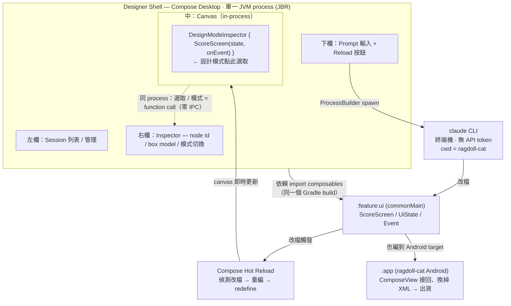
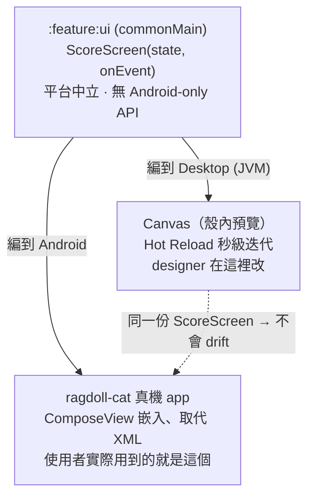
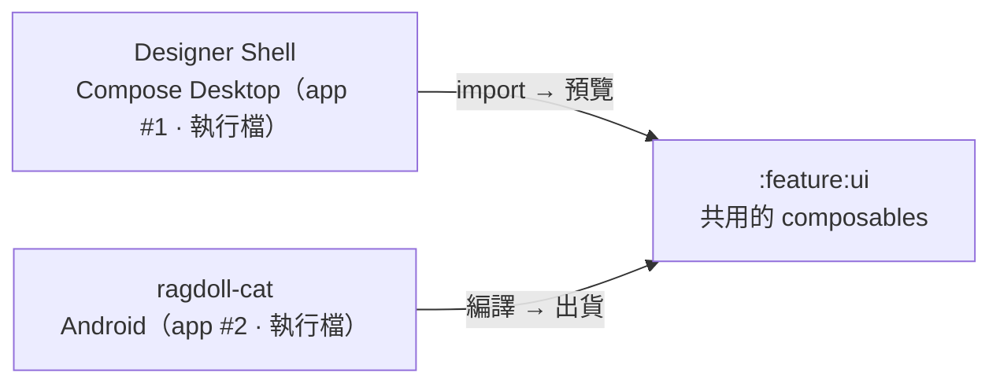
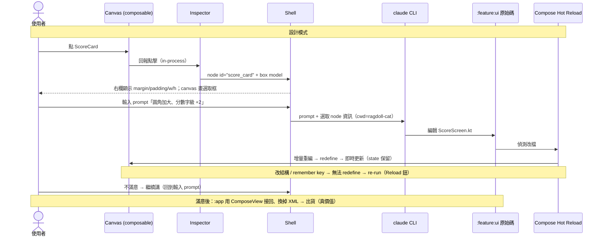

# Designer Shell 架構設計(Demo 版)

> 對象:EDU Flow Battle demo ｜ 目標 app:ragdoll-cat (ClassSwift, native Android)
> 相關文件:[`RFC-Designer-to-Code-Workflow-for-Android.md`](./RFC-Designer-to-Code-Workflow-for-Android.md)、[`RFC-battle-analysis.md`](./RFC-battle-analysis.md)
> 日期:2026-06-18 ｜ Status:設計中

---

## 0. 已鎖定的決策(本次討論結論)

| # | 決策 | 理由 |
|---|---|---|
| 1 | **Demo 優先**,單一目標(ragdoll-cat),不做通用多目標平台 | 通用化 = 每種目標一套 adapter,工程量爆炸,留 roadmap |
| 2 | **殼用 Compose Desktop** | 殼與 canvas 同 toolkit、同 process → embed 免費、選取/模式免 IPC、hot reload 順 |
| 3 | canvas = **CMP 桌面 Hot Reload 預覽**,跑的是與 app 同一份 Compose UI code | Claude Code 改檔 → 秒級看到;可從 Gradle/CLI 觸發,不靠 Android Studio |
| 4 | 走**真價值**:Compose 畫面用 `ComposeView` 接回 ragdoll-cat、換掉舊 XML | 同一份 code 同時是「預覽」與「出貨」→ 不 drift |
| 5 | 兩種模式(設計 / 互動),**in-process 狀態切換**,不需傳給外部 cs | 殼與 canvas 同 process |
| 6 | 設計模式 inspector(node id + box model)做在 **Compose 側**,由 ragdoll-cat 改 | 同 process 可直接讀 Compose layout |
| 7 | node id 用**顯式 `Modifier.designNode("…")` 語意標記**(非自動序號) | rebuild 後仍對應同一元件,AI 才指得準 |
| 8 | Claude Code 走**終端機 CLI**(無 API token),由殼用 ProcessBuilder 驅動、管理 session | 沿用使用者的 `claude` 終端機 |

---

## 1. 系統總覽:整個殼是「單一 JVM process」



---

## 2. 核心觀念:一份 UI code,兩個 target(這就是「真價值」)



> 你在 canvas 看到的不是「另一個 app」,而是**真 production UI code 在桌面上的忠實預覽**。改它 = 改出貨的畫面。

---

## 3. 澄清:是「兩個 app」、共用一個 UI module(以及換目標的可攜性)

**它們是兩個 app、兩個執行檔、兩個 run target**:



「同一份 code」指的是**共用 `:feature:ui` 這個 module**,不是「同一個 app」。

**為什麼必須共用同一個 Gradle build?** 因為 in-process 的魔法(直接呼叫 composable + 原始碼 hot reload)要求殼和目標 UI **一起編譯**。這是魔法的代價。

**那換另一個 Compose app 會不會沒救?** 不會,但要懂代價:

| | 可行性 |
|---|---|
| 把 Designer Shell **搬到另一個 Compose app** | ✅ 把 `:designer-shell` module 放進那個 app 的 build,接上它的 `:feature:ui` —— 是「重新接線」非「重寫」 |
| 一個**已編譯好的 shell 執行檔**,不改新 app 的 build 就 hot-reload 任意 Compose app | ❌ 需要「動態編譯/載入任意專案」的通用引擎(= 自己做 Compose Preview 引擎)→ 屬已延後的「通用平台」路線 |

**可攜性設計(ScreenRegistry)**:讓 `:designer-shell` 依賴一個抽象的 **ScreenRegistry** —— 每個 app 提供自己的 `{名稱, composable, fixtures}` 清單,殼本體**不寫死任何 app 的畫面**。換 app 主要就是換一份 registry。殼的程式碼(Figma chrome / inspector / claude 整合 / canvas harness)**全部可重用**。

---

## 4. Gradle 模組結構(ragdoll-cat 改造後)

現況:單一 `:app` module,55 個 XML layout + viewBinding,0 Compose。改造為 CMP 多模組:

```
ragdoll-cat  (Gradle KMP project)
├── :app                 (android)   現有 Activity/Repository/VM;逐步用 ComposeView 接回 Compose 畫面
├── :feature:<x>:ui       (common) ★  Screen / UiState / Event —— 平台中立,可預覽、可測、可 hot reload
├── :core:designsystem    (common)    AppTheme + design tokens(色票/間距/字級寫在 Kotlin)
├── :core:ui              (common)    共用 stateless 元件 + Modifier.designNode() 標記
├── :fixtures            (common)     mock data 唯一來源(loading/empty/error/populated)
└── :designer-shell      (jvm app) ★  Compose Desktop 殼 = Figma 介面 + canvas + inspector + claude 管理
                                       依賴 :feature:*:ui、:core:*、:fixtures;畫面清單透過 ScreenRegistry 注入
```

**依賴鐵律**:`:feature:*:ui` 只能依賴 `:core:*`(皆 common);`:impl/:app → :ui` 單向,**絕不反向**。一旦 `:ui` 洩漏 Android-only API,desktop target 會編譯失敗 —— compiler 幫你守平台中立。

**新增/改動清單**:
- 導入 KMP + Compose Multiplatform plugin、`org.jetbrains.compose.hot-reload` plugin、JBR runtime。
- 新建 `:designer-shell` (JVM desktop) + 各 `:feature:*:ui` common module。
- 把 demo 要秀的畫面從 XML 改寫成 Compose(放進 `:feature:*:ui`),並在 `:app` 用 `ComposeView` 接回。

---

## 5. End-to-End Demo Loop(整條流程)



---

## 6. 兩種模式

| | 設計模式 (Design) | 互動模式 (Interactive) |
|---|---|---|
| 元件 | 不可互動;點擊=選取,顯示外框 + box model | 正常 hover / selected / active |
| node id | 顯示,供 AI 精確定位 | 不顯示 |
| workflow | 不導航 | 可點擊跳頁(全 mock data,無網路) |
| 切換方式 | **殼內 in-process 狀態**(CompositionLocal),不需傳給外部 | 同左 |

**node id 穩定性(關鍵)**:AI 要靠 node id 知道「使用者指的是哪個元件」。自動序號在 rebuild 後會跑掉,所以用**顯式語意標記**:`Modifier.designNode("score_card")` 寫在元件上,inspector 讀這個 tag。AI 改完 code、node id 仍對得上同一元件。

---

## 7. Claude Code 整合(無 API token,走終端機)

- 殼用 `ProcessBuilder` spawn `claude`,工作目錄設為 ragdoll-cat repo root。
- **Session 管理**:左欄列出 session;用 `claude --resume <id>` / `--continue` 接續,或開新 session。
- **模式**:單次任務可用 `claude -p`(print/headless);需連續對話則開 pty 維持互動 session、串流解析輸出。
- **Prompt 注入**:送出前把選取 node 的(id / box model / 檔案路徑)拼進 prompt,讓 claude 精準改對元件。
- **改檔→更新**:claude 寫檔後,Hot Reload 自動接手;[Reload] 鈕作為手動觸發 / re-run 的退路。

---

## 8. 風險與待辦

| 項目 | 風險 | 處理 |
|---|---|---|
| XML → Compose 遷移 | demo 畫面要重寫成 Compose,實打實的工 | demo 只挑 1–2 個畫面 + 一條 happy path |
| node id 穩定性 | rebuild 後 id 跑掉 → AI 指錯元件 | 用顯式 `Modifier.designNode("...")` 語意標記 |
| Hot Reload 限制 | 改結構 / remember key 會重置或無法 redefine | 退化為 re-run([Reload] 鈕),demo 腳本避開大結構改動 |
| claude CLI 輸出解析 | 串流/session 狀態解析瑣碎 | 先支援單一 session + 簡單解析,夠 demo 即可 |
| 嵌入 ragdoll-cat 出貨 | ComposeView 接回要處理真資料/導航 | 真價值的最後一哩;demo 可先驗預覽,接回作為展示「同一份 code」的證據 |
| 比賽範圍 | 整套偏大,離「明天能用」遠 | 砍到單畫面 + 整條 loop 跑通即可展示核心價值 |

---

## 9. 一句話總結

**Designer Shell 是一個 Compose Desktop 應用**:它長得像 Figma(左 session、下 prompt、右 inspector、中 canvas),但 canvas 是**直接在殼自己 process 裡 render 目標 app 的同一份 Compose UI code**。因此選取、模式切換全是 in-process function call(零 IPC),Claude Code 改檔後靠 Compose Hot Reload 秒級更新 canvas;同一份 code 再經 `ComposeView` 接回 ragdoll-cat 真機出貨,達成「預覽即產品、不 drift」。**殼與目標是兩個 app、共用 `:feature:ui` module**;透過 ScreenRegistry 讓殼可重用於其他 Compose app。
