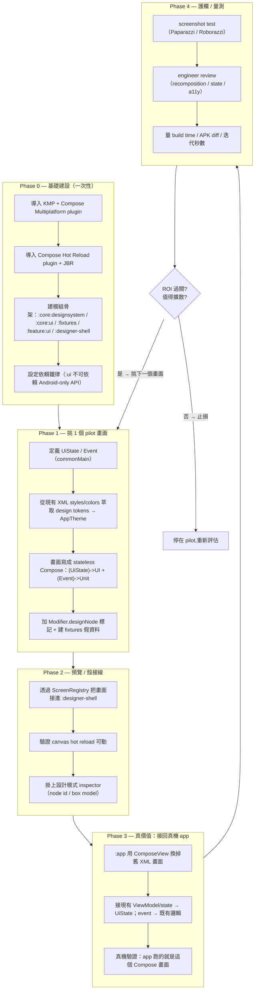
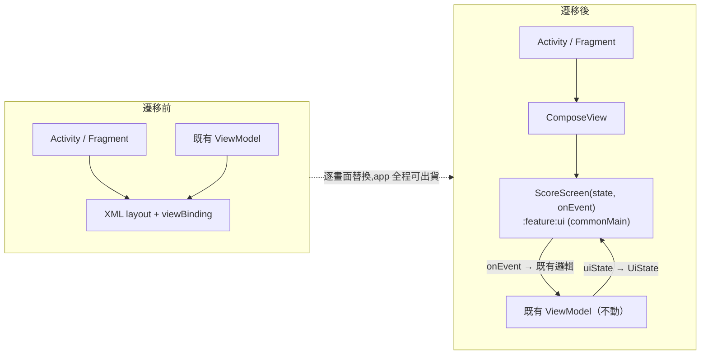
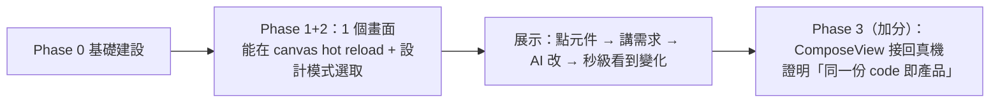

# ragdoll-cat:XML → Compose 遷移步驟

> 對象:把 ragdoll-cat(單一 `:app`、55 個 XML layout + viewBinding、0 Compose)逐步改造成支撐 Designer Shell 的 CMP 多模組。
> 相關文件:[`desktop-app-architecture.md`](./desktop-app-architecture.md)
> 策略:**strangler fig** —— 一次換一個畫面,app 全程維持可出貨,不做大爆炸式重寫。
> 日期:2026-06-18

---

## 1. 整體階段路線

Phase 0 只做一次;Phase 1–4 對「每個要遷移的畫面」重複,用 ROI gate 決定要不要繼續擴散。

---

## 2. 單一畫面怎麼被替換(strangler fig 細節)

每個畫面的替換是「把 Activity/Fragment 的 XML 內容,換成一個 `ComposeView` 來掛 Compose 畫面」,既有的 ViewModel / 商業邏輯**不動**。

**關鍵:同一份 `ScoreScreen` composable** 同時被 `:designer-shell`(桌面預覽,hot reload)與 `:app`(真機,ComposeView)使用 → 不 drift。

---

## 3. 各階段重點與遷移專屬的坑

| Phase | 重點 | 遷移專屬風險 / 注意 |
|---|---|---|
| 0 基礎建設 | 一次性把 KMP / CMP / Hot Reload / 模組骨架立穩 | Gradle sync 變慢、CI matrix 多一條;`minSdk 28` 對 Compose OK |
| 1 pilot 畫面 | UiState/Event + design token + stateless 畫面 | **design token 要從現有 XML 的 colors/dimens/styles 萃取**,否則新舊不一致;字串策略先定一邊(`String` vs `StringResource`) |
| 2 預覽接線 | 接 ScreenRegistry、驗 hot reload、掛 inspector | inspector 讀 Compose layout;node id 用顯式 `designNode("...")` |
| 3 接回真機 | ComposeView 換掉 XML、接 VM | **state 橋接**:現有可能是 LiveData/viewBinding → 要 map 成 `UiState`;一次性事件(導航/snackbar)走 VM 的 `effects`,不放進 UiState;**navigation 仍留 `:app` wiring 層** |
| 4 護欄量測 | screenshot + review + 數據 | Paparazzi vs Roborazzi 看畫面有沒有碰 Android resource 決定;先量 pilot 數字再談擴散 |

---

## 4. Demo 的最小路徑(砍到剛好夠展示)

比賽 demo 不需要遷移整個 app,只要跑通**一個畫面的整條 loop**:

- **必做**:Phase 0 + 1 + 2(一個畫面)+ 設計模式 loop。這就是核心 demo。
- **加分**:Phase 3 接回真機,作為「預覽即產品、不 drift」的鐵證。
- **可省**:Phase 4 的完整 screenshot 覆蓋、其餘 54 個畫面的遷移 —— 留到比賽後依 ROI gate 再擴散。
